# B2BB2G MVP - ERD

> 버전: 1.0.0 | 작성일: 2026-06-18 | 상태: Draft
> Feature: b2bb2g-mvp
> 참고 문서:
> - docs/01-plan/features/b2bb2g-mvp.plan.md
> - docs/02-design/features/b2bb2g-mvp.design.md

---

## 1. 목적

이 문서는 B2BB2G.COM MVP의 논리 데이터베이스 구조를 정의한다.

스키마는 다음 원칙을 따른다.

- Member Type과 Career Rank는 분리한다.
- Public Website의 기본 언어는 English다.
- Admin Dashboard의 기본 언어는 Korean이다.
- Public Company Page URL은 `/companies/[slug]`를 사용한다.
- `buy_sell_posts`는 SELL PRODUCTS 전용이다.
- `buy_requests`는 BUY REQUEST 전용이다.
- Student는 제품을 직접 등록할 수 없다.
- 회사 승인과 회사 검증은 별도 개념으로 관리한다.
- 외부 노출 콘텐츠는 승인 또는 게시 상태가 필요하다.
- 모든 비즈니스 테이블에는 RLS 정책을 적용한다.

## 2. 도메인 그룹

| 그룹 | 테이블 |
|------|--------|
| 인증과 권한 | `profiles`, `member_types`, `career_ranks`, `roles`, `permissions`, `role_permissions`, `profile_roles` |
| 회원 도메인 | `suppliers`, `buyers`, `agents`, `professors`, `students` |
| 회사와 검증 | `companies`, `company_types`, `company_verifications` |
| 국가와 산업 | `countries`, `regions`, `industries`, `country_agents` |
| 언어 | `languages`, `translations` |
| 콘텐츠 | `products`, `industrial_posts`, `epc_posts`, `buy_sell_posts`, `buy_requests` |
| 학생 활동 | `student_showcases`, `student_showcase_items`, `market_research_reports` |
| 매칭과 추천 | `matching_requests`, `referral_codes`, `referral_relations`, `rewards`, `badges` |
| Event와 FDA | `events`, `event_applications`, `thailand_fda_applications` |
| 커뮤니케이션 | `conversations`, `conversation_members`, `messages`, `message_attachments`, `announcements`, `notifications` |
| 설정 | `menus`, `categories`, `banners`, `site_settings` |
| 파일과 SEO | `files`, `seo_metadata`, `featured_contents` |
| Analytics | `analytics_events`, `buyer_sources`, `showcase_views`, `showcase_shares`, `showcase_inquiries`, `company_scores` |
| 감사와 활동 | `admin_logs`, `audit_events`, `activity_logs` |

## 3. 핵심 ERD

```mermaid
erDiagram
  auth_users ||--|| profiles : "id"

  member_types ||--o{ profiles : "member_type_id"
  career_ranks ||--o{ profiles : "career_rank_id"
  roles ||--o{ role_permissions : "role_id"
  permissions ||--o{ role_permissions : "permission_id"
  profiles ||--o{ profile_roles : "profile_id"
  roles ||--o{ profile_roles : "role_id"

  profiles ||--o| suppliers : "profile_id"
  profiles ||--o| buyers : "profile_id"
  profiles ||--o| agents : "profile_id"
  profiles ||--o| professors : "profile_id"
  profiles ||--o| students : "profile_id"

  companies ||--o{ suppliers : "company_id"
  company_types ||--o{ companies : "company_type_id"
  countries ||--o{ companies : "country_id"
  industries ||--o{ companies : "industry_id"
  companies ||--o{ company_verifications : "company_id"

  regions ||--o{ countries : "region_id"
  countries ||--o{ country_agents : "country_id"
  agents ||--o{ country_agents : "agent_id"

  languages ||--o{ translations : "language_code"

  suppliers ||--o{ products : "supplier_id"
  companies ||--o{ products : "company_id"
  categories ||--o{ products : "category_id"
  industries ||--o{ products : "industry_id"

  suppliers ||--o{ industrial_posts : "supplier_id"
  categories ||--o{ industrial_posts : "category_id"

  suppliers ||--o{ epc_posts : "supplier_id"
  categories ||--o{ epc_posts : "category_id"
  countries ||--o{ epc_posts : "project_country_id"

  suppliers ||--o{ buy_sell_posts : "supplier_id"
  categories ||--o{ buy_sell_posts : "category_id"
  countries ||--o{ buy_sell_posts : "target_country_id"

  buyers ||--o{ buy_requests : "buyer_id"
  categories ||--o{ buy_requests : "category_id"
  industries ||--o{ buy_requests : "industry_id"
  countries ||--o{ buy_requests : "destination_country_id"

  students ||--o{ student_showcases : "student_id"
  student_showcases ||--o{ student_showcase_items : "showcase_id"
  products ||--o{ student_showcase_items : "product_id"

  students ||--o{ market_research_reports : "student_id"
  countries ||--o{ market_research_reports : "country_id"
  industries ||--o{ market_research_reports : "industry_id"

  buyers ||--o{ referral_codes : "buyer_id"
  referral_codes ||--o{ referral_relations : "referral_code_id"
  buyers ||--o{ referral_relations : "parent_buyer_id"
  buyers ||--o{ referral_relations : "child_buyer_id"
  referral_relations ||--o{ rewards : "referral_relation_id"
  profiles ||--o{ rewards : "profile_id"

  profiles ||--o{ matching_requests : "requester_profile_id"
  profiles ||--o{ matching_requests : "target_profile_id"

  professors ||--o{ students : "professor_id"

  events ||--o{ event_applications : "event_id"
  profiles ||--o{ event_applications : "profile_id"

  suppliers ||--o{ thailand_fda_applications : "supplier_id"
  files ||--o{ thailand_fda_applications : "completion_report_file_id"

  conversations ||--o{ conversation_members : "conversation_id"
  profiles ||--o{ conversation_members : "profile_id"
  conversations ||--o{ messages : "conversation_id"
  profiles ||--o{ messages : "sender_profile_id"
  messages ||--o{ message_attachments : "message_id"
  files ||--o{ message_attachments : "file_id"

  profiles ||--o{ announcements : "sender_profile_id"
  profiles ||--o{ notifications : "profile_id"

  files ||--o{ banners : "file_id"
  profiles ||--o{ files : "owner_profile_id"

  profiles ||--o{ activity_logs : "profile_id"
  profiles ||--o{ admin_logs : "actor_profile_id"

  files ||--o{ products : "main_file_id"
```

## 4. 테이블 정의

### 4.1 인증과 권한

#### profiles

| 컬럼 | 타입 | 키 | 설명 |
|------|------|----|------|
| `id` | uuid | PK, FK | `auth.users.id`와 동일 |
| `email` | text | unique 권장 | 로그인과 관리자 검색 이메일 |
| `display_name` | text |  | 표시명 |
| `phone` | text |  | 소유자와 관리자 외 마스킹 |
| `country_id` | uuid | FK | `countries.id` |
| `member_type_id` | uuid | FK | `member_types.id` |
| `career_rank_id` | uuid | FK nullable | `career_ranks.id` |
| `approval_status` | text | index | 계정 승인 상태 |
| `activity_status` | text | index | active, inactive, blocked |
| `primary_language` | text | FK nullable | `languages.code` |

#### member_types

| 컬럼 | 타입 | 키 | 설명 |
|------|------|----|------|
| `id` | uuid | PK | 기본키 |
| `code` | text | unique | administrator, supplier, buyer, agent, professor, student |
| `name` | text |  | 표시명 |
| `description` | text |  | 관리자 설명 |
| `is_system` | boolean |  | 삭제 방지 여부 |

#### career_ranks

| 컬럼 | 타입 | 키 | 설명 |
|------|------|----|------|
| `id` | uuid | PK | 기본키 |
| `code` | text | unique | global_trade_ambassador, global_trade_associate 등 |
| `name` | text |  | 표시명 |
| `level_order` | integer | index | 등급 순서 |
| `is_active` | boolean |  | 활성 여부 |

#### roles, permissions, role_permissions, profile_roles

| 테이블 | 핵심 컬럼 | 설명 |
|--------|-----------|------|
| `roles` | `id`, `code`, `name` | 권한 묶음 |
| `permissions` | `id`, `code`, `name` | 세부 권한 |
| `role_permissions` | `role_id`, `permission_id` | role과 permission 연결. 복합 unique 권장 |
| `profile_roles` | `profile_id`, `role_id` | profile과 role 연결. 복합 unique 권장 |

## 5. 회원 도메인

### 5.1 suppliers

| 컬럼 | 타입 | 키 | 설명 |
|------|------|----|------|
| `id` | uuid | PK | 기본키 |
| `profile_id` | uuid | FK unique | `profiles.id` |
| `company_id` | uuid | FK | `companies.id` |
| `approval_status` | text | index | Supplier 승인 상태 |

Supplier는 연결된 company를 통해 Company Type을 반드시 선택해야 한다.

### 5.2 buyers

| 컬럼 | 타입 | 키 | 설명 |
|------|------|----|------|
| `id` | uuid | PK | 기본키 |
| `profile_id` | uuid | FK unique | `profiles.id` |
| `company_name` | text |  | Buyer 회사명 |
| `country_id` | uuid | FK index | Buyer 국가 |
| `approval_status` | text | index | Buyer 승인 상태 |

### 5.3 agents

| 컬럼 | 타입 | 키 | 설명 |
|------|------|----|------|
| `id` | uuid | PK | 기본키 |
| `profile_id` | uuid | FK unique | `profiles.id` |
| `approval_status` | text | index | Agent 승인 상태 |

모든 Agent는 `country_agents`에 최소 하나 이상의 배정 row를 가져야 한다.

### 5.4 professors

| 컬럼 | 타입 | 키 | 설명 |
|------|------|----|------|
| `id` | uuid | PK | 기본키 |
| `profile_id` | uuid | FK unique | `profiles.id` |
| `university_name` | text | index | 소속 대학명 |
| `approval_status` | text | index | Professor 승인 상태 |

### 5.5 students

| 컬럼 | 타입 | 키 | 설명 |
|------|------|----|------|
| `id` | uuid | PK | 기본키 |
| `profile_id` | uuid | FK unique | `profiles.id` |
| `professor_id` | uuid | FK nullable | 담당 Professor |
| `university_name` | text | index | 소속 대학명 |
| `graduation_status` | text | index | enrolled, graduated |

Student는 기본으로 Global Trade Ambassador rank를 받는다. Global Trade Passport는 별도 `passport_id`가 아니라 `activity_logs`, Career Rank, Badge, Reward 이력을 기반으로 구성한다.

Student는 제품을 직접 등록하지 않는다.

Student는 승인된 Supplier 제품을 선택하여 Student Showcase를 구성할 수 있다.

Global Trade Passport는 활동 로그, Career Rank, Badge, Reward, Showcase, Buyer 유치, 시장조사 이력을 기반으로 구성한다.

## 6. 회사, 국가, 검증

### 6.1 companies

| 컬럼 | 타입 | 키 | 설명 |
|------|------|----|------|
| `id` | uuid | PK | 기본키 |
| `name` | text | index | 회사명 |
| `slug` | text | unique | `/companies/[slug]` |
| `company_type_id` | uuid | FK | `company_types.id` |
| `country_id` | uuid | FK index | `countries.id` |
| `industry_id` | uuid | FK index | `industries.id` |
| `website` | text |  | 웹사이트 |
| `description` | text |  | 회사 소개 |
| `approval_status` | text | index | draft, submitted, reviewing, approved, rejected, suspended |
| `verification_status` | text | index | pending, verified, rejected, suspended |
| `approved_by` | uuid | FK nullable | 승인 관리자 profile |
| `verified_by` | uuid | FK nullable | 검증 관리자 profile |
| `approved_at` | timestamptz |  | 승인 시각 |
| `verified_at` | timestamptz |  | 검증 시각 |

`approved`는 회사가 플랫폼에서 공개 노출되고 사용될 수 있음을 의미한다. `verified`는 회사가 신뢰 검증을 통과했음을 의미한다.

### 6.2 company_verifications

| 컬럼 | 타입 | 키 | 설명 |
|------|------|----|------|
| `id` | uuid | PK | 기본키 |
| `company_id` | uuid | FK index | `companies.id` |
| `status` | text | index | pending, verified, rejected, suspended |
| `business_registration_checked` | boolean |  | 사업자등록 확인 여부 |
| `website_checked` | boolean |  | 웹사이트 확인 여부 |
| `catalog_checked` | boolean |  | 카탈로그 확인 여부 |
| `certificate_checked` | boolean |  | 인증서 확인 여부 |
| `review_note` | text |  | 관리자 검토 메모 |
| `reviewed_by` | uuid | FK | 관리자 profile |
| `reviewed_at` | timestamptz |  | 검토 시각 |

### 6.3 countries, regions, industries, company_types

| 테이블 | 핵심 컬럼 | 설명 |
|--------|-----------|------|
| `regions` | `id`, `name`, `sort_order` | 지역 마스터 |
| `countries` | `id`, `name`, `code`, `region_id`, `status`, `sort_order` | 국가 마스터 |
| `industries` | `id`, `name`, `parent_id`, `is_active`, `sort_order` | 산업 마스터 |
| `company_types` | `id`, `name`, `is_active`, `sort_order` | 회사 유형 마스터 |

### 6.4 country_agents

| 컬럼 | 타입 | 키 | 설명 |
|------|------|----|------|
| `id` | uuid | PK | 기본키 |
| `country_id` | uuid | FK index | `countries.id` |
| `agent_id` | uuid | FK index | `agents.id` |
| `status` | text | index | active, inactive, suspended |
| `assigned_at` | timestamptz |  | 배정 시각 |

권장 unique key: `country_id`, `agent_id`.

## 7. 콘텐츠 ERD

### 7.1 products

| 컬럼 | 타입 | 키 | 설명 |
|------|------|----|------|
| `id` | uuid | PK | 기본키 |
| `supplier_id` | uuid | FK index | `suppliers.id` |
| `company_id` | uuid | FK index | `companies.id` |
| `category_id` | uuid | FK | `categories.id` |
| `industry_id` | uuid | FK | `industries.id` |
| `title` | text | index | 제품명 |
| `summary` | text |  | 요약 |
| `description` | text |  | 상세 설명 |
| `approval_status` | text | index | 공개 노출 시 approved 필요 |
| `main_file_id` | uuid | FK nullable | `files.id` |

### 7.2 industrial_posts and epc_posts

| 테이블 | 핵심 FK | 설명 |
|--------|---------|------|
| `industrial_posts` | `supplier_id`, `category_id` | 산업설비 게시글 |
| `epc_posts` | `supplier_id`, `category_id`, `project_country_id` | EPC 프로젝트 게시글 |

### 7.3 buy_sell_posts

SELL PRODUCTS 전용 테이블이다.

| 컬럼 | 타입 | 키 | 설명 |
|------|------|----|------|
| `id` | uuid | PK | 기본키 |
| `post_type` | text | check | `sell_product` 고정 |
| `author_profile_id` | uuid | FK | `profiles.id` |
| `supplier_id` | uuid | FK index | `suppliers.id` |
| `category_id` | uuid | FK | `categories.id` |
| `title` | text | index | 제목 |
| `description` | text |  | 내용 |
| `target_country_id` | uuid | FK nullable | `countries.id` |
| `approval_status` | text | index | 공개 노출 시 approved 필요 |

### 7.4 buy_requests

BUY REQUEST 전용 테이블이다.

| 컬럼 | 타입 | 키 | 설명 |
|------|------|----|------|
| `id` | uuid | PK | 기본키 |
| `buyer_id` | uuid | FK index | `buyers.id` |
| `category_id` | uuid | FK | `categories.id` |
| `industry_id` | uuid | FK | `industries.id` |
| `title` | text | index | 제목 |
| `quantity` | text |  | MVP에서는 유연한 텍스트 |
| `target_price` | text |  | MVP에서는 유연한 텍스트 |
| `destination_country_id` | uuid | FK index | `countries.id` |
| `details` | text |  | 비소유자에게 보호 필요 |
| `approval_status` | text | index | 공개 노출 시 approved 필요 |

### 7.5 student_showcases

Student가 승인된 Supplier 제품을 기반으로 구성하는 제품 소개 공간이다.

Student Showcase는 제품 등록이 아니라 제품 소개, Buyer 유치, Matching 지원 활동이다.

| 컬럼 | 타입 | 키 | 설명 |
|------|------|----|------|
| `id` | uuid | PK | 기본키 |
| `student_id` | uuid | FK index | `students.id` |
| `title` | text | index | Showcase 제목 |
| `description` | text |  | Showcase 설명 |
| `target_country_id` | uuid | FK index | `countries.id` |
| `approval_status` | text | index | draft, submitted, reviewing, approved, rejected |
| `created_by` | uuid | FK | `profiles.id` |
| `approved_by` | uuid | FK nullable | 관리자 profile |
| `approved_at` | timestamptz |  | 승인 시각 |

### 7.6 student_showcase_items

Showcase에 포함된 승인 제품 목록이다.

| 컬럼 | 타입 | 키 | 설명 |
|------|------|----|------|
| `id` | uuid | PK | 기본키 |
| `showcase_id` | uuid | FK index | `student_showcases.id` |
| `product_id` | uuid | FK index | `products.id` |
| `display_order` | integer | index | 표시 순서 |
| `student_note` | text |  | 학생 소개 문구 |

Student는 product 원본 데이터를 수정할 수 없다.

### 7.7 market_research_reports

Student가 작성하는 국가별 시장조사 보고서다.

| 컬럼 | 타입 | 키 | 설명 |
|------|------|----|------|
| `id` | uuid | PK | 기본키 |
| `student_id` | uuid | FK index | `students.id` |
| `country_id` | uuid | FK index | `countries.id` |
| `industry_id` | uuid | FK index | `industries.id` |
| `title` | text | index | 보고서 제목 |
| `summary` | text |  | 요약 |
| `content` | text |  | 본문 |
| `approval_status` | text | index | 승인 상태 |
| `created_by` | uuid | FK | `profiles.id` |
| `approved_by` | uuid | FK nullable | 관리자 profile |
| `approved_at` | timestamptz |  | 승인 시각 |

## 8. 매칭, 추천, 보상

### 8.1 matching_requests

| 컬럼 | 타입 | 키 | 설명 |
|------|------|----|------|
| `id` | uuid | PK | 기본키 |
| `requester_profile_id` | uuid | FK index | `profiles.id` |
| `target_profile_id` | uuid | FK index | `profiles.id` |
| `matching_type` | text | index | supplier_buyer, buyer_agent, professor_supplier, student_buyer |
| `status` | text | index | requested, reviewing, approved, rejected, closed |
| `admin_note` | text |  | 관리자 전용 |

### 8.2 referral_codes and referral_relations

| 테이블 | 핵심 컬럼 | 설명 |
|--------|-----------|------|
| `referral_codes` | `id`, `buyer_id`, `code`, `is_active` | 모든 Buyer가 갖는 기본 추천코드. `buyer_id` unique, `code` unique |
| `referral_relations` | `parent_buyer_id`, `child_buyer_id`, `referral_code_id`, `status`, `reward_status` | 상위 Buyer와 하위 Buyer 관계 |

### 8.3 rewards and badges

| 테이블 | 핵심 컬럼 | 설명 |
|--------|-----------|------|
| `rewards` | `profile_id`, `reward_type`, `status`, `approved_by` | 관리자 수동 승인 기반 보상 |
| `badges` | `code`, `name`, `criteria` | 관리자 설정 기반 배지 |

## 9. Event, FDA, 커뮤니케이션

### 9.1 events and event_applications

| 테이블 | 핵심 컬럼 | 설명 |
|--------|-----------|------|
| `events` | `category_id`, `title`, `status`, `created_by` | 관리자만 생성 |
| `event_applications` | `event_id`, `profile_id`, `status` | 회원 참가 신청 |

### 9.2 thailand_fda_applications

| 컬럼 | 타입 | 키 | 설명 |
|------|------|----|------|
| `id` | uuid | PK | 기본키 |
| `supplier_id` | uuid | FK index | 신청 Supplier |
| `service_category` | text | index | FDA 카테고리 |
| `product_name` | text |  | 제품명 |
| `formula_summary` | text |  | 기밀 정보 |
| `status` | text | index | FDA workflow |
| `quoted_amount` | numeric |  | 관리자 전용 |
| `admin_note` | text |  | 관리자 전용 |
| `completion_report_file_id` | uuid | FK | `files.id` |

### 9.3 conversations and messages

| 테이블 | 핵심 컬럼 | 설명 |
|--------|-----------|------|
| `conversations` | `id`, `conversation_type`, `created_by`, `is_blocked` | 1:1 메시지 또는 공지 |
| `conversation_members` | `conversation_id`, `profile_id`, `last_read_at` | 복합 unique 권장 |
| `messages` | `conversation_id`, `sender_profile_id`, `body`, `blocked_at` | 메시지 본문 |
| `message_attachments` | `message_id`, `file_id` | 메시지와 파일 연결 |

Agent는 배정된 하부 Buyer와만 메시지를 주고받을 수 있다. Professor는 배정된 Student와만 메시지를 주고받을 수 있다.

## 10. 설정, 파일, SEO, 감사

### 10.1 menus, categories, banners, site_settings

모든 설정 테이블은 관리자가 관리한다. 공개 UI와 대시보드 UI는 가능한 경우 설정 데이터를 읽어 사용한다.

### 10.2 files

| 컬럼 | 타입 | 키 | 설명 |
|------|------|----|------|
| `id` | uuid | PK | 기본키 |
| `bucket` | text | index | Storage bucket |
| `path` | text | bucket 내 unique | Object path |
| `mime_type` | text |  | 파일 형식 |
| `size_bytes` | bigint |  | 파일 크기 |
| `owner_profile_id` | uuid | FK index | 업로드 사용자 |
| `visibility` | text | index | public, private, restricted |

### 10.3 seo_metadata and featured_contents

| 테이블 | 핵심 컬럼 | 설명 |
|--------|-----------|------|
| `seo_metadata` | `target_table`, `target_id`, `meta_title`, `meta_description`, `canonical_url` | 공개 SEO |
| `featured_contents` | `target_table`, `target_id`, `featured_level`, `featured_until` | 추천 노출 |

### 10.4 admin_logs, audit_events, activity_logs

| 테이블 | 목적 |
|--------|------|
| `admin_logs` | 관리자 운영 로그 |
| `audit_events` | 보안과 시스템 감사 이벤트 |
| `activity_logs` | 회원 활동 timeline |

## 11. 인덱스 전략

| 테이블 | 인덱스 컬럼 | 목적 |
|--------|-------------|------|
| `products` | `approval_status` | 공개 승인 제품 목록 |
| `products` | `supplier_id`, `approval_status` | Supplier 대시보드 |
| `companies` | `slug` | Public Company Page 조회 |
| `companies` | `country_id` | 국가 필터 |
| `companies` | `approval_status`, `verification_status` | 공개 노출과 검증 회사 필터 |
| `buy_requests` | `destination_country_id` | 국가 필터 |
| `buy_requests` | `buyer_id`, `approval_status` | Buyer 대시보드 |
| `buy_sell_posts` | `supplier_id`, `approval_status` | Supplier SELL PRODUCTS |
| `student_showcases` | `student_id`, `approval_status` | Student Showcase 관리 |
| `student_showcases` | `target_country_id`, `approval_status` | 국가별 Showcase 검색 |
| `student_showcase_items` | `showcase_id`, `product_id` | Showcase 제품 구성 |
| `market_research_reports` | `student_id`, `approval_status` | Student 시장조사 관리 |
| `market_research_reports` | `country_id`, `industry_id` | 국가/산업별 시장조사 검색 |
| `messages` | `conversation_id` | 대화 thread 로딩 |
| `conversation_members` | `profile_id`, `conversation_id` | 접근 검증 |
| `country_agents` | `country_id`, `agent_id` | Agent 국가 배정 |

Unique index:

- `companies.slug`
- `languages.code`
- `translations(language_code, translation_key)`
- `referral_codes.buyer_id`
- `referral_codes.code`
- `student_showcase_items(showcase_id, product_id)`
- `country_agents(country_id, agent_id)`
- `conversation_members(conversation_id, profile_id)`

## 12. 구현 순서

1. 마스터 테이블: `member_types`, `career_ranks`, `regions`, `countries`, `industries`, `company_types`, `languages`.
2. Auth 연결 테이블: `profiles`.
3. 권한 테이블: `roles`, `permissions`, `role_permissions`, `profile_roles`.
4. 회원 도메인 테이블: `suppliers`, `buyers`, `agents`, `professors`, `students`.
5. 회사와 검증 테이블: `companies`, `company_verifications`, `country_agents`.
6. 설정 테이블: `menus`, `categories`, `site_settings`, `translations`.
7. 콘텐츠 테이블: `products`, `industrial_posts`, `epc_posts`, `buy_sell_posts`, `buy_requests`.
7-1. 학생 활동 테이블: `student_showcases`, `student_showcase_items`, `market_research_reports`.
8. 비즈니스 네트워크 테이블: `matching_requests`, `referral_codes`, `referral_relations`, `rewards`, `badges`.
9. Event와 FDA 테이블.
10. 커뮤니케이션 테이블.
11. 파일, SEO, 추천 노출 테이블.
12. 감사와 활동 로그.
13. 인덱스.
14. RLS helper functions와 policies.

## 13. ERD 구현 규칙

- 모든 기본키는 `uuid`를 사용한다.
- 모든 시간 컬럼은 `timestamptz`를 사용한다.
- 중요한 비즈니스 레코드는 soft delete를 사용한다.
- 메뉴, 카테고리, 국가, 산업, 회사 유형, 배지, 상태, 번역 문자열은 하드코딩하지 않는다.
- 회사의 `approval_status`와 `verification_status`는 분리한다.
- `buy_sell_posts`와 `buy_requests`는 분리한다.
- `member_types`와 `career_ranks`는 분리한다.
- `profile_roles(profile_id, role_id)`는 unique로 관리한다.
- `referral_codes.buyer_id`와 `referral_codes.code`는 unique로 관리한다.
- Global Trade Passport는 `students.passport_id` 없이 활동 로그와 Career Rank, Badge, Reward 이력으로 구성한다.
- Public Website route는 `/companies/[slug]`를 사용한다.
- Student 소유 제품 등록은 허용하지 않는다.
- Student는 제품을 직접 등록하지 않는다.
- Student Showcase는 승인된 Supplier 제품을 기반으로만 구성한다.
- Student Showcase는 product 원본 데이터를 수정하지 않는다.
- Student Showcase 공개는 `approval_status = approved` 기준으로 한다.
- Market Research Report는 관리자 승인 후 공개 또는 내부 공유한다.
- 애플리케이션 클라이언트에 테이블을 노출하기 전 RLS를 먼저 적용한다.
